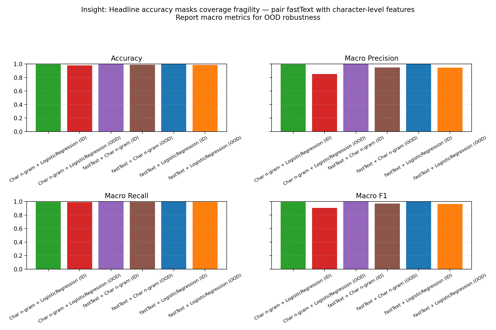
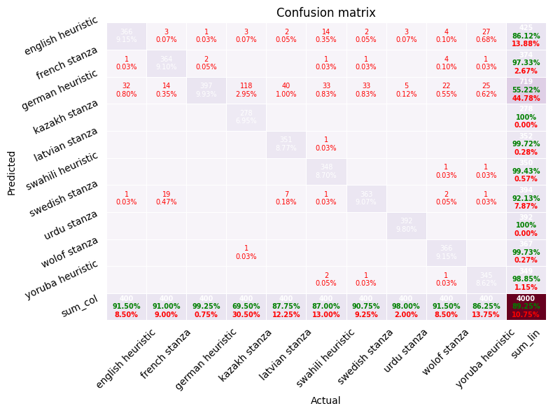
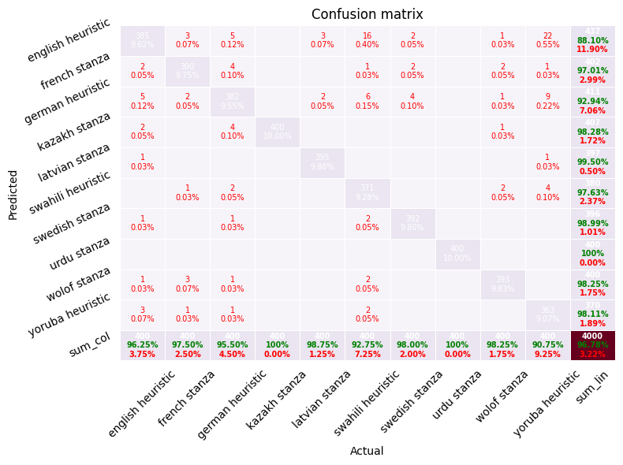
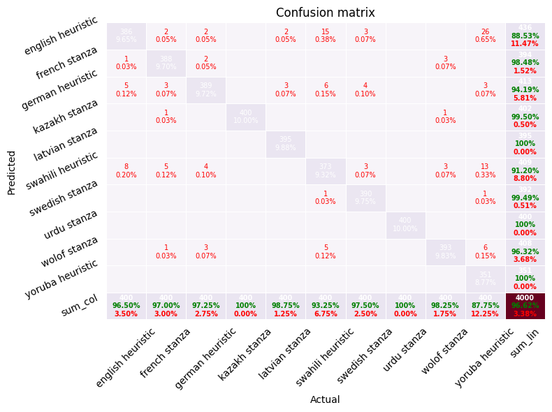
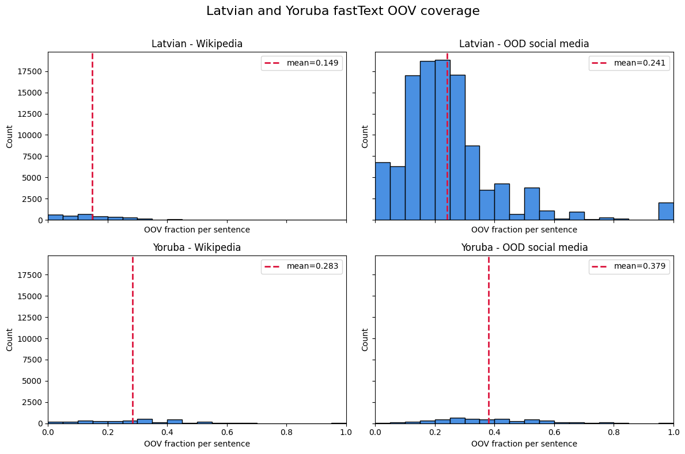

# Language Identification Project: Presentation Draft

## Project overview
- **Goal:** Build and evaluate multilingual sentence-level language identification spanning Latin and Cyrillic scripts.
- **Datasets:** Multilingual Wikipedia samples exported to CoNLL-U via `prepare_multilingual_conllu_stanza.py`, with Stanza annotations when available and heuristic fallbacks elsewhere. Evaluation uses 4,000 held-out sentences (400 per language) across 10 labels, as prepared in Milestone 1 and refined in Milestone 2.
- **Languages:** German (de), English (en), French (fr), Swedish (sv), Latvian (lv), Swahili (sw), Wolof (wo), Yoruba (yo), Kazakh (kk), Urdu (ur).

**Speaker notes:**
- Open by framing this as a sentence-level language ID problem across two scripts.
- Emphasize the controlled Wikipedia split and the 10-language balance to justify fair comparisons.
- Mention that Milestone 2 refines the same data pipeline to keep results comparable.

## Approaches compared
- **Rule-based heuristics**
  - Unicode script detection, diacritic patterns, cue words/affixes; computationally cheap and interpretable.
- **Character n-gram logistic regression (TF–IDF)**
  - Lightweight classical ML baseline on character n-grams; strong accuracy with small footprint.
- **XLM-RoBERTa fine-tuning**
  - Multilingual transformer for sequence classification; robust across scripts but compute-heavy.
- **fastText averaged embeddings (Q1 study)**
  - Multinomial logistic regression on pretrained word vectors; high ID accuracy but OOD brittleness due to OOV coverage gaps.

**Speaker notes:**
- Walk through methods from simplest to most compute-heavy.
- Highlight interpretability of rules vs. robustness of XLM-R.
- Flag fastText as an OOD case study rather than the main baseline.

## Key results
- **Milestone 2 (in-domain Wikipedia evaluation, 10 languages)**
  - Rule-based: 0.89 accuracy.
  - Char n-gram logistic regression: **0.968 accuracy** (best overall) with near-perfect recall on several classes.
  - XLM-R fine-tuning: 0.966 accuracy; similar confusion profile, slightly better French/Swedish recall.
  - Insight: n-gram model offers best accuracy–cost balance; rules remain useful for diagnostics; XLM-R for harder domains.
- **Q1 fastText OOD study (hate speech/social media, 5 languages)**
  - Wikipedia (ID) accuracy: 0.998; OOD combined accuracy: **0.9863** (–0.0117 drop).
  - Per-language OOD accuracy: 0.9959 (kk), 0.9840 (lv), 1.0000 (sv, ur), 0.9996 (yo).
  - OOV rates highlight brittleness: Latvian 24.1% OOV (469k unseen terms); Yoruba 37.9% OOV (20,801 unseen terms).
  - Insight: headline metrics mask coverage fragility; pair fastText with character-level features and report macro metrics for OOD robustness.
- **Detailed OOD robustness (fastText vs. character n-grams, 5 languages)**
  - **Macro OOD accuracy / F1 (mean of per-language F1s):** fastText 0.9859 / 0.6659; char n-gram 0.9800 / 0.5058; fastText + char n-gram 0.9877 / 0.7991.
  - **Per-language macro F1 (OOD):** fastText vs. char n-gram vs. combined
    - Kazakh: 0.4989 vs. 0.5000 vs. 0.4993.
    - Latvian: 0.3306 vs. 0.1976 vs. 0.4963 (largest robustness gain from char features).
    - Swedish: 1.0000 vs. 0.4994 vs. 1.0000.
    - Urdu: 1.0000 vs. 1.0000 vs. 1.0000.
    - Yoruba: 0.4999 vs. 0.3318 vs. 1.0000 (character features resolve OOV-driven collapse).
  - **Slide takeaway:** macro metrics surface the failure modes hidden by headline accuracy; combining fastText with character n-grams consistently improves OOD robustness.
  - **Visualization:** comparative macro metrics plot from `reports/ood_fasttext_char_summary.png`.
    

**Speaker notes:**
- Lead with the headline: char n-gram is the best accuracy–cost trade-off in-domain.
- Clarify that XLM-R is close but heavier, so it’s a choice for harder domains.
- For OOD, stress that accuracy drop is small but macro F1 exposes real failures.
- Point to the combined model as the robustness win, especially for Latvian/Yoruba.

## Final solution slide: fastText primary + character n-gram fallback
- **Model design:** fastText embeddings + logistic regression for primary predictions, with a character n-gram TF–IDF + logistic regression fallback when the sentence OOV ratio exceeds **0.3**.
- **Coverage intent:** route noisy, misspelled, or transliterated sentences to the char n-gram model for higher robustness.
- **Training setup (final notebook):**
  - Languages: Kazakh, Latvian, Swedish, Yoruba, Urdu.
  - Max sentences per language: 2,000; split 0.7 / 0.1 / 0.2.
  - Char n-gram settings: ngram range 3–5, min_df 2, max_features 200k.
- **Results (from final solution run log):**
  - **In-domain (Wikipedia):** Accuracy 0.9755; Macro F1 0.9754.
  - **OOD (combined datasets):** Accuracy 0.9764; Macro F1 0.9007 (Macro Recall 0.9839).
  - **Routing behavior:** 80.55% of in-domain and 92.04% of OOD sentences routed to fallback.
- **Slide takeaway:** The fallback routing mitigates OOV brittleness while preserving strong accuracy, making it the recommended deployment path for noisy OOD data.

**Speaker notes:**
- Explain that the final solution operationalizes the mitigation plan with an explicit OOV routing threshold.
- Emphasize that OOD macro metrics are the stress test for robustness, and the fallback improves them.
- Call out the high fallback usage as evidence of real-world noise and justify the two-stage design.

## Deployment considerations: latency vs. hardware
- **Character n-gram (TF–IDF + logistic regression)**
  - **Hardware:** CPU-only; 10–20 MB model fits in laptop memory.
  - **Latency:** ~<5 ms/sentence on a single core; scales linearly with batch size, dominated by feature extraction.
- **XLM-R fine-tuning**
  - **Hardware:** GPU recommended; `base` needs ~1–2 GB VRAM for inference (more for batch >16). CPU-only runs are slow.
  - **Latency:** ~30–80 ms/sentence on an A10/T4 GPU; 300 ms+ on CPU without quantization or distillation.
- **Deployment takeaway:** Default to the n-gram model for general serving and on-CPU environments; reserve XLM-R for domain-shifted or robustness-critical deployments where the added latency and GPU cost are acceptable.

**Speaker notes:**
- Translate metrics into practical deployment guidance (CPU vs. GPU).
- Call out the magnitude difference in latency as the key decision point.
- Tie back to stakeholders: “default to n-gram unless domain shift demands XLM-R.”

## Error analysis highlights
- Rule-based errors: Latin-script overlap drags Kazakh/Latvian/Yoruba into German; numeric lists lack cues.
- Char n-gram errors: confusions among orthographically similar pairs (English↔Yoruba, Swedish↔English) and short numeric snippets.
- XLM-R errors: swaps between Swahili/Wolof and German for borrowed-vocabulary sentences; over-indexing on high-resource patterns.
- fastText OOD errors: short or transliterated posts (e.g., two-token Kazakh) mislabelled as Yoruba; OOV-driven fragility despite high accuracy.

**Speaker notes:**
- Use this slide to humanize model behavior with concrete error patterns.
- Emphasize that most errors are explainable and cluster by script/orthography.
- Bridge to the next visuals as evidence for these patterns.

## Visual confusion matrices (10-language Wikipedia split)
- **Rule-based heuristics:** confusion remains concentrated among closely related Latin-script languages, with Kazakh/Latvian/Yoruba bleeding into German but strong precision on Urdu thanks to script cues.
  
- **Character n-gram logistic regression:** errors shrink markedly; primary confusions cluster around English↔Swedish and occasional Yoruba overlap, while Cyrillic Kazakh is cleanly separated.
  
- **XLM-R fine-tuning:** comparable to the n-gram model with slightly better French/Swedish separation and minimal cross-script leakage.
  

**Speaker notes:**
- Walk the audience left-to-right: rules → n-gram → XLM-R.
- Point out the clean Cyrillic separation as a success story.
- Note the persistent English/Swedish confusion as the main remaining ambiguity.

## fastText OOV coverage diagnostics
- **Latvian vs. Yoruba fastText OOV rates (social media):** distributions highlight heavy tails and the prevalence of unseen terms, reinforcing the risk of deploying embeddings without character-level backups.
  
- **Diagnostic takeaway (current script):** the histograms signal where fastText alone is fragile due to high OOV rates. Our evaluation script (`scripts/evaluate_ood_xlmr_vs_fasttext.py`) is the pre-mitigation version, so mitigation remains a manual recommendation rather than an automated flag.
- **Reproducibility:** generated via the notebook-style script `reports/latvian_yoruba_oov_histograms. run 4.1.2026.md`, which computes per-token OOV ratios from the OOD hate-speech corpus.

**Speaker notes:**
- Explain what OOV means and why it matters for word-only embeddings.
- Highlight the stark difference between Latvian/Yoruba and why that drives failures.
- Mention that current tooling surfaces the issue but doesn’t auto-mitigate yet.

## Mitigation plan: character features and subword models
- **What:** Reduce OOV brittleness by moving from pure word embeddings to tokenization schemes that always produce features.
  - **Character n-gram features:** fall back to the TF–IDF character n-gram pipeline already used for Wikipedia benchmarking; guarantees coverage for unseen words and transliterations.
  - **Subword models (BPE/SentencePiece):** swap fastText vectors for a subword-aware encoder (e.g., BPEmb or a distilled multilingual transformer); minimizes vocabulary gaps while keeping model size moderate.
- **Why it matters:** The OOD hate-speech set shows high OOV rates (24%+ for Latvian, 37%+ for Yoruba). Word-only embeddings drop tokens entirely, masking confusion and inflating confidence. Character/subword features ensure every token contributes signal.
- **How to wire into the evaluation script (`scripts/evaluate_ood_xlmr_vs_fasttext.py`):**
  1) **Add a character-feature branch:** load the existing char n-gram vectorizer and logistic regression model (from Milestone 2 artifacts) and route OOD text through it alongside fastText/XLM-R. Aggregate metrics per model to compare robustness.
  2) **Introduce a subword encoder:** replace the fastText embedding lookup with a SentencePiece/BPE tokenizer plus an average-pooled embedding (or compact transformer). Cache the tokenizer/model weights on disk and update the data loader to emit subword tokens.
  3) **Flag OOV tokens explicitly:** log OOV counts per sentence for the word-embedding path; surface them in the evaluation summary to show mitigation impact.
  4) **CLI toggles:** add `--use-char` and `--use-subword` flags to switch baselines; default to fastText for parity with prior results but enable side-by-side runs.
  5) **Outputs:** extend the metrics dataframe to include the new baselines and write confusion matrices for each. Add a short note in the plot titles indicating whether mitigation is enabled.
- **Slide takeaway:** Coverage-focused mitigation is actionable now: load the char n-gram baseline, drop in a subword encoder, expose flags, and report OOV-aware metrics so production can choose the safest model for noisy domains.

**Speaker notes:**
- Position this as a concrete engineering backlog, not just research ideas.
- Stress that character n-grams are already proven in-domain, so they’re the low-risk add-on.
- Close with the message: “coverage mitigations are actionable and measurable.”

## Recommendations for stakeholders
- **Primary baseline:** Character n-gram logistic regression for best accuracy–efficiency trade-off (Milestone 2).
- **Diagnostic fallback:** Maintain rule-based heuristics for interpretability and rapid checks; extend with richer cues for Cyrillic variants.
- **High-performance/shifted domains:** Deploy XLM-R when domain shift or code-switching warrants transformer robustness, accepting higher compute costs.
- **OOD coverage checks:** When using pretrained embeddings (e.g., fastText), audit OOV rates per target domain and pair with character-level features to mitigate brittleness; mitigation is not yet built into the evaluation script.

**Speaker notes:**
- Deliver these as decision-ready recommendations for product owners.
- Emphasize the default path (n-gram) and the escalation path (XLM-R).
- Remind stakeholders to budget time for OOD audits.

## Next steps for the presentation
- Pair the Latvian/Yoruba OOV histograms with a note that mitigation (character features, subword models) is currently manual and not yet wired into the evaluation script.
- Confirm the latency/hardware slide placement after key results to frame accuracy vs. compute trade-offs before recommendations.
- Prepare speaker notes emphasising when to trade accuracy for interpretability or compute efficiency.

**Speaker notes:**
- Close with immediate actions to finalize the deck structure.
- Reiterate the narrative flow: results → deployment trade-offs → recommendations.
