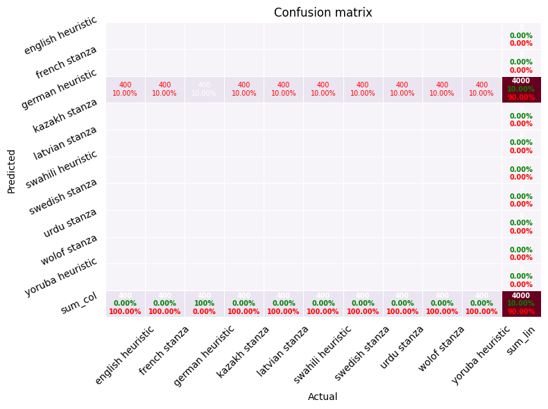
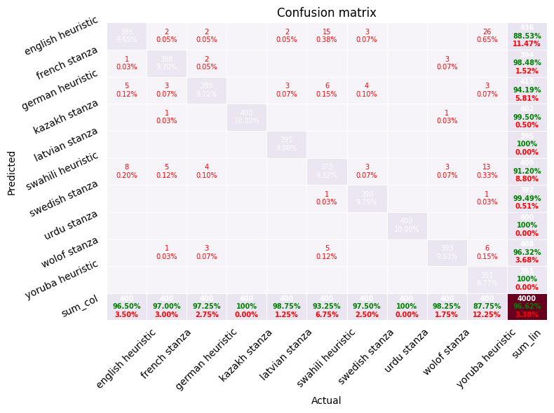

    C:\Users\Maxim\conda\lib\site-packages\torchvision\io\image.py:13: UserWarning: Failed to load image Python extension: '[WinError 127] The specified procedure could not be found'If you don't plan on using image functionality from `torchvision.io`, you can ignore this warning. Otherwise, there might be something wrong with your environment. Did you have `libjpeg` or `libpng` installed before building `torchvision` from source?
      warn(
    INFO: Loading multilingual dataset from data
    INFO: Loaded 20000 sentences across 10 languages
    INFO: Training rule-based baseline
    

    
    --------------------------------------------------------------------------------
    Dataset preview (first and last sentences)
    --------------------------------------------------------------------------------
    First 10 sentences:
    [01] Gadsden ni mji wa Marekani katika jimbo la Alabama.
    [02] Jägerhornska regementet - 1 bataljon under ledning av överste Jägerhorn Nylands dragoner - 33 ryttare Nylands dragonvargering Åbo läns vargeringsbataljon - 1 bataljon Nylands läns vargeringsbataljon - 1 bataljon Björneborgs läns vargeringsbataljon - 1 bataljon Tavastehus läns vargeringsbataljon - 1 bataljon Svea artilleriregemente - 1 kompani.
    [03] En 2012, le Morocco Mall a reçu à Cannes le prix Marché international des professionnels de l'immobilier dans la catégorie du meilleur centre commercial sur le plan architectural.
    [04] Källor Externa länkar Skogsmöss hyrcanicus
    [05] Similarly, Nick Coleman wrote that after visiting the club in July 1988, he immediately went from designer clothing and standing around "trying to look cool", to wearing t-shirts, jeans and ...[and having] 50 new friends".
    [06] No 1941. līdz 1963. gadam strādāja Staļingradas M. Gorkija vārdā nosauktajā drāmas teātrī.
    [07] Paljaskero är ett naturreservat i Övertorneå kommun i Norrbottens län.
    [08] Pope Leo III jẹ́ Póòpù Ìjọ Kátólìkì tẹ́lẹ̀.
    [09] Notes et références
    [10] Urbanisme Typologie Blancherupt est une commune rurale, car elle fait partie des communes peu ou très peu denses, au sens de la grille communale de densité de l'Insee.
    
    Last 10 sentences:
    [19991] 1978—2003 жылдар аралығында "Кітап" өндірістік бірлестігінің (кейін "Дәуір" баспасы болып аталды) терім сехында оператор-терімші болып істеді.
    [19992] البتہ جی پی او میں ایک پرانا گھنٹا دکھائی دیتا ہے جس پر 1860ء درج ہے۔
    [19993] Despite the hostility of the Latin patriarch, Amalric of Nesle, Baldwin continued to court the Greek patriarch, Leontius, in hopes that the Byzantines would remain committed to his kingdom.
    [19994] Viņa pēdējā spēle izlasē bija 1999. gadā, viesos nospēlējot neizšķirti 2:2 pret Gruziju.
    [19995] Orodha hii inataja wafalme wakuu (au Kaizari) wote wa Dola Takatifu la Kiroma la Taifa la Kijerumani kuanzia Karoli Mkuu.
    [19996] B grupā Ford panākumus guva ar Ford RS200. 1999. gadā, dažādos etapos, Ford izmantoja dažādas Ford Focus WRC versijas.
    [19997] oluilu ipinle Naijiria
    [19998] Boroom xam-xam yi daa def gëstu yooyu di kojug nite, ñi ngi leen di woowe ñoñ nite, walla boroom njàggat yi.
    [19999] Die Geldnot des Kaisers Sigismund zwangen ihn, die in Ungarn aufbewahrten Reichskleinodien gegen tausend Mark in Silber der Reichsstadt Nürnberg zu überlassen.
    [20000] über Kilibo und Toui in das Département Borgou.
    

    INFO: Training character n-gram logistic regression
    C:\Users\Maxim\conda\lib\site-packages\sklearn\linear_model\_logistic.py:1247: FutureWarning: 'multi_class' was deprecated in version 1.5 and will be removed in 1.7. From then on, it will always use 'multinomial'. Leave it to its default value to avoid this warning.
      warnings.warn(
    INFO: Fine-tuning XLM-R model
    

    Map:   0%|          | 0/14400 [00:00<?, ? examples/s]

    Map:   0%|          | 0/1600 [00:00<?, ? examples/s]

    Some weights of XLMRobertaForSequenceClassification were not initialized from the model checkpoint at xlm-roberta-base and are newly initialized: ['classifier.dense.bias', 'classifier.dense.weight', 'classifier.out_proj.bias', 'classifier.out_proj.weight']
    You should probably TRAIN this model on a down-stream task to be able to use it for predictions and inference.
    C:\Users\Maxim\conda\lib\site-packages\torch\utils\data\dataloader.py:666: UserWarning: 'pin_memory' argument is set as true but no accelerator is found, then device pinned memory won't be used.
      warnings.warn(warn_msg)
    

    

      <progress value='1800' max='1800' style='width:300px; height:20px; vertical-align: middle;'></progress>
      [1800/1800 2:19:38, Epoch 1/1]
    

    <table border="1" class="dataframe">
  <thead>
 <tr style="text-align: left;">
      <th>Step</th>
      <th>Training Loss</th>
    </tr>
  </thead>
  <tbody>
    <tr>
      <td>1800</td>
      <td>0.328200</td>
    </tr>
  </tbody>
</table>

    Map:   0%|          | 0/4000 [00:00<?, ? examples/s]

    
    ================================================================================
    Results for Rule-based heuristics
    ================================================================================
    Accuracy: 0.1000
    
    Classification report:
    label           precision  recall  f1-score  support
    english heuristic     0.000   0.000    0.000      400
    french stanza       0.000   0.000    0.000      400
    german heuristic     0.100   1.000    0.182      400
    kazakh stanza       0.000   0.000    0.000      400
    latvian stanza      0.000   0.000    0.000      400
    swahili heuristic     0.000   0.000    0.000      400
    swedish stanza      0.000   0.000    0.000      400
    urdu stanza         0.000   0.000    0.000      400
    wolof stanza        0.000   0.000    0.000      400
    yoruba heuristic     0.000   0.000    0.000      400
    macro avg           0.010   0.100    0.018     4000
    weighted avg        0.010   0.100    0.018     4000
    
    Confusion matrix (rows = gold, columns = predicted):
                english heuristic french stanza german heuristic kazakh stanza latvian stanza swahili heuristic swedish stanza urdu stanza wolof stanza yoruba heuristic
    english heuristic0          0          400        0          0          0          0          0          0          0         
    french stanza0          0          400        0          0          0          0          0          0          0         
    german heuristic0          0          400        0          0          0          0          0          0          0         
    kazakh stanza0          0          400        0          0          0          0          0          0          0         
    latvian stanza0          0          400        0          0          0          0          0          0          0         
    swahili heuristic0          0          400        0          0          0          0          0          0          0         
    swedish stanza0          0          400        0          0          0          0          0          0          0         
    urdu stanza 0          0          400        0          0          0          0          0          0          0         
    wolof stanza0          0          400        0          0          0          0          0          0          0         
    yoruba heuristic0          0          400        0          0          0          0          0          0          0         
    

    <Figure size 800x600 with 0 Axes>

    

    

    Saved prettified confusion matrix to reports\confusion_matrix_rule_based_heuristics.png
    
    Representative misclassifications:
    - Gold label english heuristic:
        predicted german heuristic :: University of Chicago Press, 1953 Harry Kalven Jr.
        predicted german heuristic :: Benjamin Mark Seymour (born 16 April 1999) is an English professional footballer who plays as a forward for National League South club Hampton & Richmond Borough.
    - Gold label french stanza:
        predicted german heuristic :: Références Bibliographie Ignacio URÍA, Viento norte.
        predicted german heuristic :: Entre-temps, KB Saliout fusionne avec l'usine Khrounitchev pour former le GKNPZ Khrounitchev.
    - Gold label kazakh stanza:
        predicted german heuristic :: Дереккөздер География және геодезия
        predicted german heuristic :: 14-16 ғ. көптеген мемлекеттерде ордендер мен медальдар жасала бастады.
    - Gold label latvian stanza:
        predicted german heuristic :: Platons bieži tiek minēts kā visbagātākais informācijas avots par Sokrata dzīvi un filozofiju.
        predicted german heuristic :: Barību meklē uz ūdensaugiem, gan augošiem ūdenī, gan krastā.
    - Gold label swahili heuristic:
        predicted german heuristic :: Tazama pia Orodha ya visiwa vya Tanzania Tanbihi Viungo vya nje Geonames.org Visiwa vya Tanzania Ziwa Viktoria Mkoa wa Kagera
        predicted german heuristic :: Kata ya Naipanga imeundwa na vijiji vinne (4) ambavyo ni Naipanga, Joshoni, Congo na Nagaga.
    - Gold label swedish stanza:
        predicted german heuristic :: Källor Berg i Litauen
        predicted german heuristic :: Fotboll, konditionsträning och jogging har varit de huvudsakliga sportintressena i hans liv.
    - Gold label urdu stanza:
        predicted german heuristic :: پھر جب اٹھارہ سو ستاون کی جنگ آزادی واقع ہوئی تب نواب بھوپال نے اپنی ریاست میں امن و امان قائم رکھنے کے لیےانگریزی فوج کا ساتھ دیا ،
        predicted german heuristic :: انہوں نے کہا کہ شرکت کرنے والی ٹیمیں لاہور لائنز، پشاور ڈیرز، کراچی ڈولفنز، کوئٹہ پینتھرز اور اسلام آباد شاہین شامل ہیں۔
    - Gold label wolof stanza:
        predicted german heuristic :: Bañ a nelaw guddi
        predicted german heuristic :: Bamu mujj di ku xarañe bépp xam-xamu Lislaam, te it di kuy jëfe ngirum Tassawuuf ci anam gu xóot, Jigéen ci lislaam:
    - Gold label yoruba heuristic:
        predicted german heuristic :: Ní ọdún 2014, Boafo kópa nínu eré oníṣókí kan tí àkọ́lé rẹ̀ jẹ́ Bus Nut.
        predicted german heuristic :: Iṣẹ́ orílẹ̀-ède Nàìjíríà Arábìnrin náà gbá bọ́ọ̀lù fún ikọ̀ agbábọ́ọ̀lù sínú agbọ̀n ti àwọn obìnrin First Bank ti orílẹ̀-ède Nàìjíríà ti ìlú Èkó tí a mọ̀ sí Elephant Girls nígbà…
    
    ================================================================================
    Results for Char n-gram logistic regression
    ================================================================================
    Accuracy: 0.9677
    
    Classification report:
    label           precision  recall  f1-score  support
    english heuristic     0.881   0.963    0.920      400
    french stanza       0.970   0.975    0.973      400
    german heuristic     0.929   0.955    0.942      400
    kazakh stanza       0.983   1.000    0.991      400
    latvian stanza      0.995   0.988    0.991      400
    swahili heuristic     0.976   0.927    0.951      400
    swedish stanza      0.990   0.980    0.985      400
    urdu stanza         1.000   1.000    1.000      400
    wolof stanza        0.983   0.983    0.983      400
    yoruba heuristic     0.981   0.907    0.943      400
    macro avg           0.969   0.968    0.968     4000
    weighted avg        0.969   0.968    0.968     4000
    
    Confusion matrix (rows = gold, columns = predicted):
                english heuristic french stanza german heuristic kazakh stanza latvian stanza swahili heuristic swedish stanza urdu stanza wolof stanza yoruba heuristic
    english heuristic385        2          5          2          1          0          1          0          1          3         
    french stanza3          390        2          0          0          1          0          0          3          1         
    german heuristic5          4          382        4          0          2          1          0          1          1         
    kazakh stanza0          0          0          400        0          0          0          0          0          0         
    latvian stanza3          0          2          0          395        0          0          0          0          0         
    swahili heuristic16         1          6          0          0          371        2          0          2          2         
    swedish stanza2          2          4          0          0          0          392        0          0          0         
    urdu stanza 0          0          0          0          0          0          0          400        0          0         
    wolof stanza1          2          1          1          0          2          0          0          393        0         
    yoruba heuristic22         1          9          0          1          4          0          0          0          363       
    

    <Figure size 800x600 with 0 Axes>

    

    

    Saved prettified confusion matrix to reports\confusion_matrix_char_n_gram_logistic_regression.png
    
    Representative misclassifications:
    - Gold label english heuristic:
        predicted yoruba heuristic :: University of Chicago Press, 1953 Harry Kalven Jr.
        predicted swedish stanza :: Author Stephen J.
    - Gold label french stanza:
        predicted english heuristic :: Discographie The Wrestling Album (1985) Piledriver - The Wrestling Album 2 (1987) WWF Full Metal (1996) WWF The Music, Vol. 2 (1997) (1997) WWF The Music, Vol. 3 (1998) WWF The…
        predicted wolof stanza :: Napoli sacra.
    - Gold label german heuristic:
        predicted kazakh stanza :: 306–312.
        predicted english heuristic :: Vera religio vindicata contra omnis generis incredulos, Stahel, Würzburg 1771.
    - Gold label latvian stanza:
        predicted german heuristic :: Geschichte der Böhmischen Provinz der Gesellschaft Jesu, I, Wien 1910; S. Polčin.
        predicted german heuristic :: Vācu ordeņa Prūsijas mestri 1229.-1239. Hermans Balke (Hermann Balk) 1239.-1244. Heinrihs no Veidas (Heinrich von Weida) 1244.-1246. Popo no Osternas (Poppo von Osterna)…
    - Gold label swahili heuristic:
        predicted german heuristic :: Oppenheimer, J.R.
        predicted english heuristic :: Miaka ya 1980 Miaka ya 1990 Miaka ya 2000 Kifo chake Tuzo za Academy Filmografia The Autobiography of Miss Jane Pittman (1974) Heartbeeps (Oscar Nomination) (1981) The Thing…
    - Gold label swedish stanza:
        predicted english heuristic :: Diskografi Studioalbum Living In A Box (1987) Gatecrashing (1989) Samlingsalbum The Best of Living in a Box (1999) The Very Best of Living in a Box (2003) Living In A Box - The…
        predicted english heuristic :: Proceedings of the Royal Society of Edinburgh 20:76-93.
    - Gold label wolof stanza:
        predicted english heuristic :: Lees bind ci moom Kathleen Sheldon, Historical Dictionary of Women in Sub-Saharan Africa, The Scarecrow Press, Inc., 2005, 448 p.
        predicted kazakh stanza :: — 376 с.
    - Gold label yoruba heuristic:
        predicted english heuristic :: This could be determined by the kind of job this person does or wealth.
        predicted german heuristic :: Lehnigk, On the Hurwitz matrix, Zeitschrift für Angewandte Mathematik und Physik (ZAMP), May 1970 Bernard A.
    
    ================================================================================
    Results for XLM-R fine-tuning
    ================================================================================
    Accuracy: 0.9663
    
    Classification report:
    label           precision  recall  f1-score  support
    english heuristic     0.885   0.965    0.923      400
    french stanza       0.985   0.970    0.977      400
    german heuristic     0.942   0.973    0.957      400
    kazakh stanza       0.995   1.000    0.998      400
    latvian stanza      1.000   0.988    0.994      400
    swahili heuristic     0.912   0.932    0.922      400
    swedish stanza      0.995   0.975    0.985      400
    urdu stanza         1.000   1.000    1.000      400
    wolof stanza        0.963   0.983    0.973      400
    yoruba heuristic     1.000   0.877    0.935      400
    macro avg           0.968   0.966    0.966     4000
    weighted avg        0.968   0.966    0.966     4000
    
    Confusion matrix (rows = gold, columns = predicted):
                english heuristic french stanza german heuristic kazakh stanza latvian stanza swahili heuristic swedish stanza urdu stanza wolof stanza yoruba heuristic
    english heuristic386        1          5          0          0          8          0          0          0          0         
    french stanza2          388        3          1          0          5          0          0          1          0         
    german heuristic2          2          389        0          0          4          0          0          3          0         
    kazakh stanza0          0          0          400        0          0          0          0          0          0         
    latvian stanza2          0          3          0          395        0          0          0          0          0         
    swahili heuristic15         0          6          0          0          373        1          0          5          0         
    swedish stanza3          0          4          0          0          3          390        0          0          0         
    urdu stanza 0          0          0          0          0          0          0          400        0          0         
    wolof stanza0          3          0          1          0          3          0          0          393        0         
    yoruba heuristic26         0          3          0          0          13         1          0          6          351       
    

    <Figure size 800x600 with 0 Axes>

    

    

    Saved prettified confusion matrix to reports\confusion_matrix_xlm_r_fine_tuning.png
    
    Representative misclassifications:
    - Gold label english heuristic:
        predicted swahili heuristic :: University of Chicago Press, 1953 Harry Kalven Jr.
        predicted swahili heuristic :: Author Stephen J.
    - Gold label french stanza:
        predicted swahili heuristic :: Discographie The Wrestling Album (1985) Piledriver - The Wrestling Album 2 (1987) WWF Full Metal (1996) WWF The Music, Vol. 2 (1997) (1997) WWF The Music, Vol. 3 (1998) WWF The…
        predicted german heuristic :: Libros de la Catarata-Instituto Franklin de Estudios Norteamericanos (Universidad de Alcalá), Madrid, 2021.
    - Gold label german heuristic:
        predicted french stanza :: Lausanne 1998.
        predicted swahili heuristic :: 398–425.
    - Gold label latvian stanza:
        predicted german heuristic :: Geschichte der Böhmischen Provinz der Gesellschaft Jesu, I, Wien 1910; S. Polčin.
        predicted german heuristic :: Beznoteces ezers.
    - Gold label swahili heuristic:
        predicted german heuristic :: Oppenheimer, J.R.
        predicted wolof stanza :: Anastasii Sinaïtae: Viae dux.
    - Gold label swedish stanza:
        predicted english heuristic :: Diskografi Studioalbum Living In A Box (1987) Gatecrashing (1989) Samlingsalbum The Best of Living in a Box (1999) The Very Best of Living in a Box (2003) Living In A Box - The…
        predicted swahili heuristic :: Aitken, J. 1882-1883.
    - Gold label wolof stanza:
        predicted kazakh stanza :: — 376 с.
        predicted french stanza :: Yero Sylla, Grammatical Relations and Fula Syntax, Los Angeles, University of California, 1979 (Thèse PhD) Louis Léon César Faidherbe, Vocabulaire d'environ 1,500 mots français…
    - Gold label yoruba heuristic:
        predicted english heuristic :: This could be determined by the kind of job this person does or wealth.
        predicted wolof stanza :: Diedie Khan bere si ni da korin latin 1978.
    
    ################################################################################
    Model comparison and qualitative notes
    ################################################################################
    
    Accuracy overview:
    - Rule-based heuristics               0.1000
    - Char n-gram logistic regression     0.9677
    - XLM-R fine-tuning                   0.9663
    
    Operational trade-offs:
    * Rule-based heuristics: extremely cheap to run and interpretable, but they
      depend on linguistic expertise to curate the cues and struggle to scale to
      language families that share scripts or borrow vocabulary.
    * Char n-gram logistic regression: inexpensive to train and requires little
      feature engineering. It scales to new languages as long as labelled data
      is available, though it cannot leverage sub-word semantics beyond n-gram
      statistics.
    * XLM-R fine-tuning: delivers the strongest accuracy in most scenarios and
      generalises across scripts thanks to multilingual pretraining. The trade-off
      is substantially higher computational cost and a dependency on GPU
      resources, which may be prohibitive for rapid experimentation.
    
    
